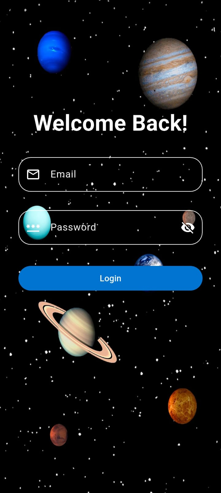
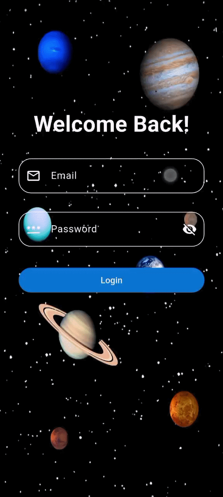

# DevelopersHub Corporation — Flutter Internship

## Week 1: Basic Flutter Development and UI Building

Welcome to the repository for **Week 1** of the online Flutter Development Internship at **DevelopersHub Corporation**. This project focuses on setting up the environment, designing a clean and responsive login screen, implementing form validation, and managing navigation.

---

## 🎯 Learning Objectives
- **Flutter Structure:** Understand the default folder structure, configuration files (`pubspec.yaml`), and the entry point of a Flutter app (`main.dart`).
- **Responsive UI Design:** Use key Flutter widgets (`Column`, `Row`, `Container`, `Padding`, `CustomScrollView`, etc.) to build responsive screens that adapt to different screen sizes.
- **Navigation:** Learn to route users between screens (Login Screen $\rightarrow$ Home Screen).
- **Form Validation:** Validate input fields dynamically (email format verification, password requirements).

---

## 🛠️ Tasks Completed

1. **Environment Setup:**
   - Installed Flutter SDK and set up the IDE environment (Android Studio / VS Code).
   - Initialized a clean, structured Flutter project.

2. **Basic Login UI:**
   - Structured the UI using layout widgets like `Column`, `Row`, `Container`, `Padding`, and `SafeArea`.
   - Embedded a custom background image with smooth styling.
   - Built input forms with fields for Email and Password (complete with clear labels, hint text, leading icons, and interactive password visibility toggles).
   - Designed a login action button (`ElevatedButton`) and links/structure for "Forgot Password?".

3. **Navigation:**
   - Developed a Home Screen (`MyHomePage`) to land on after successful authentication.
   - Implemented route navigation using Flutter's native `Navigator` API to transition screens.

4. **Form Validation:**
   - Created dynamic validation rules:
     - **Email:** Validates format using Regex to ensure standard syntax (e.g., `user@domain.com`).
     - **Password:** Ensures the field is not empty.

---

## 📱 Visual Previews

### App Screenshot
Here is the static view of the Login Screen interface:



### App Walkthrough Demo
Below is a GIF showing the live validation flow and navigation behavior of the app:



---

## 🚀 How to Run the Project

Follow these steps to run the application locally on your emulator, simulator, or physical device:

### 1. Prerequisites
Ensure you have the Flutter SDK installed on your system. Run `flutter doctor` to verify:
```bash
flutter doctor
```

### 2. Clone and Navigate to the Repository
```bash
git clone https://github.com/<your-username>/<your-repo-name>.git
cd <your-repo-name>
```

### 3. Install Dependencies
Run the command below in the project root directory to fetch all necessary Flutter packages:
```bash
flutter pub get
```

### 4. Run the App
Launch the app on a connected device:
```bash
flutter run
```

---

## 📂 Project Structure
A brief overview of the key directories/files created for this task:
* `lib/main.dart` - Application entry point containing the material app wrapper and the home page screen.
* `lib/screens/login_screen.dart` - Contains the full login UI implementation including form fields, email/password validators, and interactive widgets.
* `ss/` - Holds screenshot and demonstration GIF assets referenced in this documentation.
